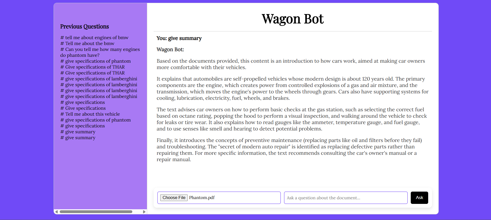

# Wagon Bot 

Wagon Bot is a chatbot that answers user questions based only on the contents of two documents:
- A static **specification explainer PDF** (system-level)
- A **user-uploaded PDF**

It uses Google's Gemini Pro via LangChain to retrieve relevant answers using vector search and prompt-based LLM inference.


## UI 



https://github.com/user-attachments/assets/2979ee50-2e86-497d-9d39-a99cd3e94025


## Features
- Upload any PDF and ask questions based on its content
- Cross-analyzes user and system documents
- Uses Gemini Pro to provide factual, document-grounded answers
- Retrieves relevant text chunks using FAISS vector search
- Clean web interface built with Flask, HTML, CSS, and JavaScript
- Real-time chat interface with message history
- Document processing with text extraction and chunking


## Tech Stack
**Backend**
- Flask (Web framework)
- LangChain (LLM orchestration)
- Google Gemini API (`gemini-pro`, `embedding-001`)
- FAISS (Vector similarity search)
- PyMuPDF (PDF processing)

**Frontend**
- HTML5
- CSS3
- JavaScript
- Responsive design

## Installation
 **1. Clone the Repository**
```bash
git clone https://github.com/your-username/wagon-bot.git
```
**2. Create Virtual Environment**
```bash
python -m venv venv
# Activate virtual environment
# On Windows:
venv\Scripts\activate
# On macOS/Linux:
source venv/bin/activate
```

**3. Install Dependencies**
```bash
pip install -r requirements.txt
```

**4. Set Up Environment Variables**

Create a `.env` file in the root directory and add your Google API key:
```bash
# Create .env file
touch .env  # On Windows: type nul > .env
```
Add the following content to your `.env` file:
```env
GOOGLE_API_KEY=your_actual_api_key_here
```

### Running the Application

**1. Start the Flask Server**
```bash
# Make sure your virtual environment is activated
python backend/connecter.py
```

**2. Access the Application**
Open the `index.html` file

**3. Using Wagon Bot**
1. **Upload a PDF**: Click the upload button to select and upload a PDF document
2. **Ask Questions**: Type your questions in the chat interface
3. **Get Answers**: The bot will analyze both your uploaded PDF and the system specification document to provide relevant answers

